# OpenStory Launcher Tutorial

## Introduction

**OpenStory Launcher** is the official game client for the OpenStory project, providing a seamless experience for downloading, managing, and launching games. No manual environment setup is required — just download and play.

> **⚠️ Note: Currently, only Windows is supported.**

---

# Part 1: User Guide

## 1. Download the Client

Visit [https://github.com/ZJU-LLMs/OpenStory/releases](https://github.com/ZJU-LLMs/OpenStory/releases), find the latest release, and download the client exe file.

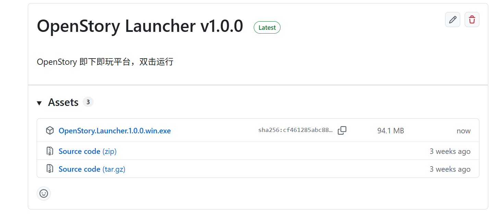

---

## 2. Launch the Client

Once downloaded, **double-click the exe file**. The client starts automatically in a few seconds — no installation needed.

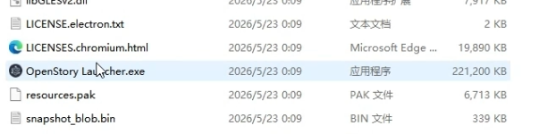

---

## 3. Main Interface Overview

The client opens on the **About** page, showing the OpenStory project introduction and latest news. The left sidebar provides five modules:

- **About** — Project introduction and updates
- **Store** — Browse and download games
- **Library** — Manage installed games
- **Downloads** — Monitor download progress
- **Settings** — Customize your experience

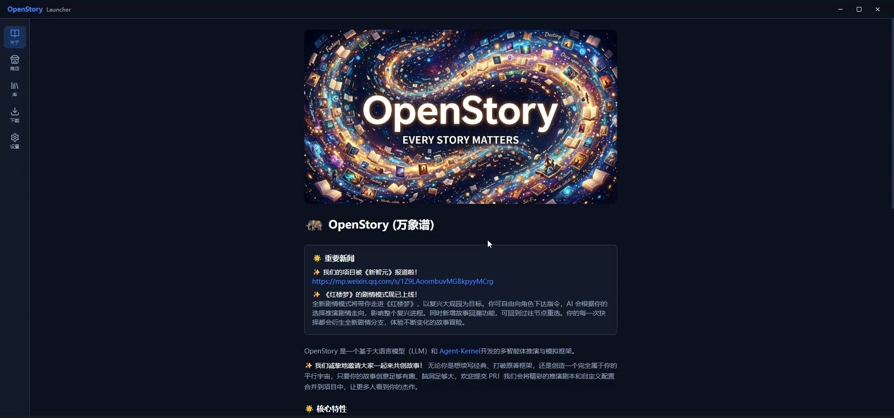

---

## 4. Browse the Store

Click **"Store"** in the sidebar to see all available games, each displayed with a cover image, title, and brief description.

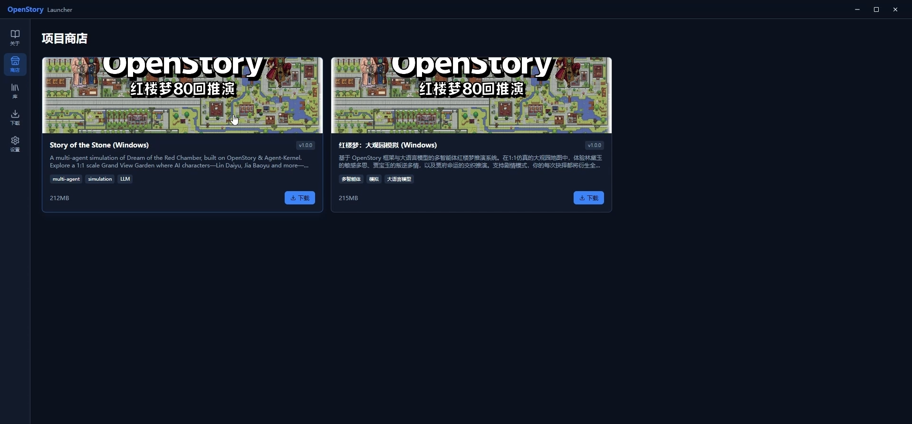

---

## 5. View Game Details

**Click any game card** to open a detailed view with the full description, version info, and a download button.

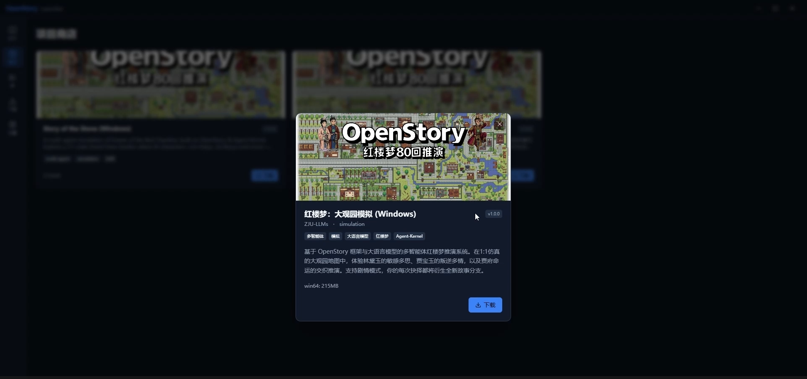

---

## 6. Customize Settings

Click **"Settings"** in the sidebar to configure:

- **Theme**: Toggle between dark and light mode
- **Language**: Switch between 中文 and English
- **Download path**: Choose a custom installation directory via the "Change" button

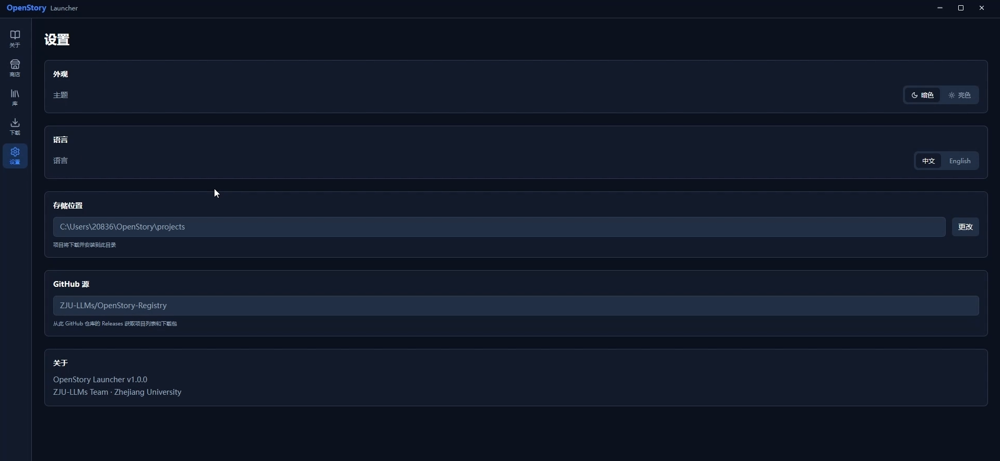

---

## 7. Download a Game

After clicking **"Download"** in the store or detail view, switch to the **"Downloads"** page to watch the real-time progress. The client automatically downloads and extracts the game package.

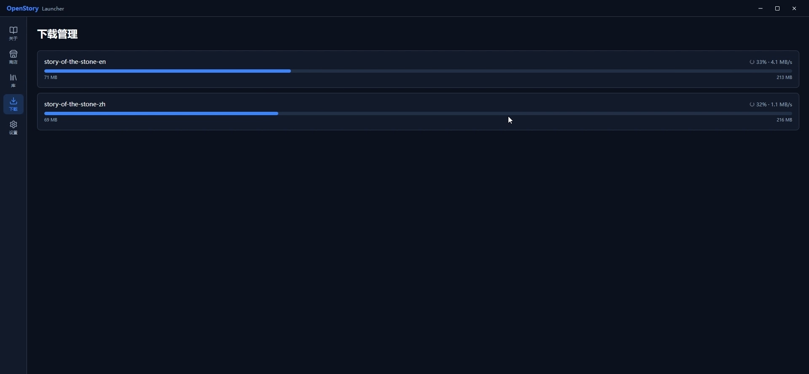

---

## 8. Game Added to Library

Once the download is complete, the client automatically sets up the local environment. The game appears in your **Library** with no manual steps required.

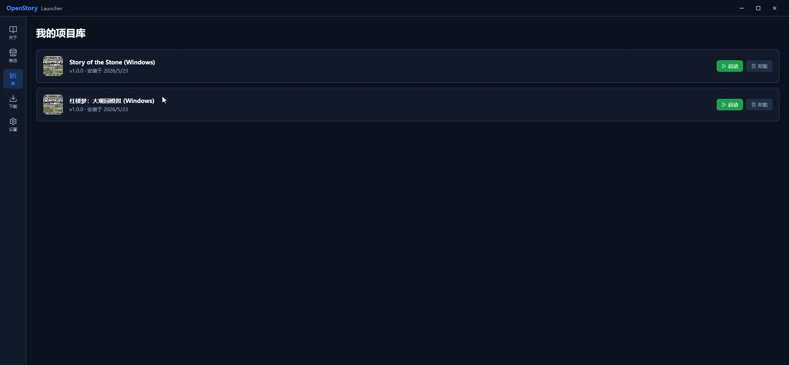

---

## 9. Launch a Game

In the **Library**, find the game you want to play and click **"Launch"**. The game starts immediately and the client switches to "Playing" status.

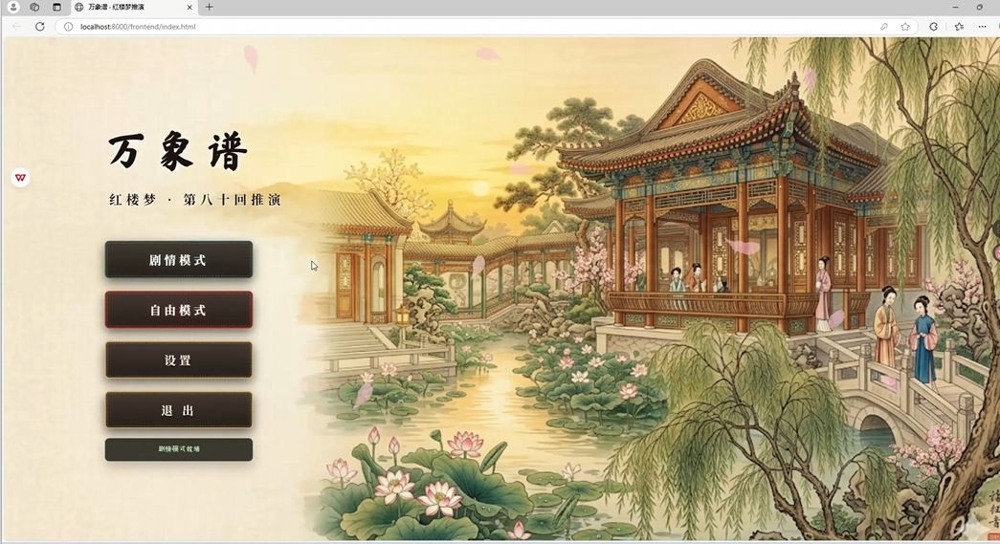

---

## 10. Configure API Settings

> **⚠️ Note:** Games are powered by large language models. Before playing for the first time, you need to provide your API credentials in the game interface.

Fill in the following fields and save before starting:

- **API Key** — Your LLM API key
- **API URL** — The endpoint of your model service
- **Model** — The model name to use (e.g., `gpt-4o`)

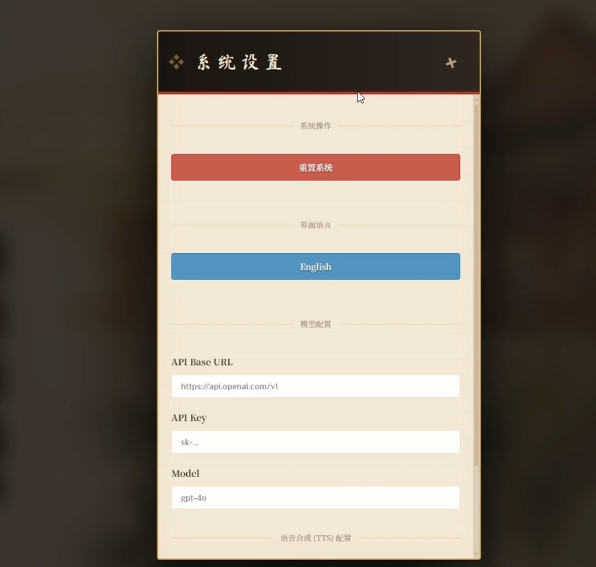

---

## 11. Start Playing

Once configured, click start and dive into the game world — an immersive experience powered by AI.

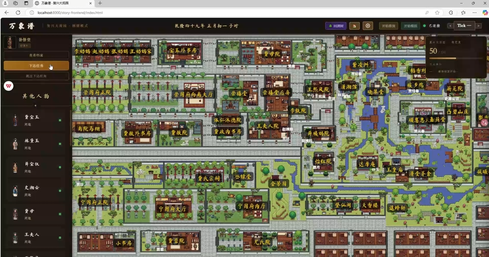

---

# Part 2: Game Packaging Specification

This section is for developers who want to publish their own game on OpenStory Launcher.

---

## 1. Package Directory Structure

The extracted game package must follow this structure, with the game folder as the top-level directory:

```
your-game-id/
  manifest.json        ← Required: launch configuration
  launch.bat           ← Windows startup script
  game/                ← Game code and assets
  runtime/             ← Runtime dependencies (Python, Redis, etc.)
  ...
```

---

## 2. manifest.json Format

Place `manifest.json` in the root of the game folder. The client uses this file to identify and launch the game:

```json
{
  "id": "your-game-id",
  "name": "Your Game Name",
  "version": "1.0.0",
  "launch": {
    "type": "bat",
    "command": "launch.bat",
    "working_dir": ".",
    "port": 8001
  }
}
```

| Field | Description |
|---|---|
| `id` | Unique game identifier, must match `projects.json` |
| `name` | Display name shown in the client |
| `version` | Version string |
| `launch.command` | Startup command, relative to `working_dir` |
| `launch.working_dir` | Working directory, typically `.` (game root) |
| `launch.port` | TCP port the game server listens on; the client polls this port to detect when the game is ready. Omit if no server is needed |

---

## 3. Packaging Requirements

**You must use Python's `zipfile` module** to create the zip archive. Do not use Windows built-in compression, 7-Zip, or any other tool — these store filenames in a non-UTF-8 encoding that causes garbled Chinese paths when extracted.

Packaging script:

```python
import zipfile, os

def pack(src_dir, output_zip):
    src_dir = os.path.abspath(src_dir)
    base = os.path.dirname(src_dir)
    with zipfile.ZipFile(output_zip, 'w', zipfile.ZIP_DEFLATED, allowZip64=True) as zf:
        for root, dirs, files in os.walk(src_dir):
            for f in files:
                path = os.path.join(root, f)
                arcname = os.path.relpath(path, base).replace('\\', '/')
                zf.write(path, arcname)

pack(r'D:\your-game-id', r'D:\your-game-id.zip')
```

The resulting zip structure should look like:

```
your-game-id/manifest.json
your-game-id/launch.bat
your-game-id/game/...
your-game-id/runtime/...
```

---

## 4. projects.json Entry

Maintain `projects.json` in the `project-index` Release of the repository. Add one entry per game:

```json
{
  "id": "your-game-id",
  "name": "游戏名（中文）",
  "name_en": "Game Name (English)",
  "description": "Game description shown in the store card and detail view.",
  "author": "ZJU-LLMs",
  "cover": "https://direct-link-to-cover-image",
  "category": "simulation",
  "tags": ["tag1", "tag2"],
  "latest_version": "1.0.0",
  "release_tag": "your-game-id-v1.0.0",
  "platforms": ["win64"],
  "size": {"win64": "200MB"}
}
```

| Field | Description |
|---|---|
| `release_tag` | Must exactly match the GitHub Release tag |
| `cover` | Use a raw GitHub link for images stored in the repository |
| `platforms` | Currently supports `win64` |

---

## 5. Publish to GitHub Release

Perform the following steps in the `ZJU-LLMs/OpenStory` repository:

**① Upload the game package**

Create a new Release with the tag `your-game-id-v1.0.0` and upload the zip file as an asset.

**② Update the project index**

Edit the Release with tag `project-index`, and replace `projects.json` with the updated version containing your new entry.

---

## 6. Web Page Performance Requirements

The game's frontend runs inside the client's embedded browser (Electron Chromium). User experience directly depends on how well the web page handles common interactions. Pay attention to the following areas during development:

### 6.1 Mode Switching

- When switching game modes (e.g., story mode / free mode), fully clean up frontend state before initializing the new mode to avoid stale data contamination
- Block user interaction during the switch (e.g., show a loading overlay) and re-enable it only after the transition is complete, preventing duplicate triggers
- The backend switching endpoint should be idempotent — multiple identical requests must not produce side effects

### 6.2 Back and Forward Navigation

- Use frontend routing (e.g., the History API) for in-game page transitions instead of full page reloads, to preserve game state continuity
- Prevent the browser's default back-navigation from exiting the game (intercept via `history.pushState` or the `popstate` event)
- For multi-step flows, pressing back should restore the previous valid step rather than jumping directly to the home screen

### 6.3 Page Refresh

- Persist critical game state (current scene, character position, dialogue history, etc.) periodically to the backend or `localStorage` to avoid losing everything on a refresh
- After a refresh, automatically restore the most recent valid state and show the user a clear recovery indicator
- Avoid re-launching backend tasks on refresh; check whether the service is already running before starting (e.g., via port detection)

### 6.4 Avoiding Freezes and Conflicts

- Time-consuming operations such as AI inference must run asynchronously in the background; the frontend should poll or use WebSocket to track progress — never block the main thread
- Only one inference request should be in flight at any given time; debounce or disable the trigger button to prevent duplicates
- When a request has not responded for more than 30 seconds, show a timeout notice and offer cancel or retry options
- When multiple AI characters act concurrently, prevent write conflicts on shared resources (map tiles, dialogue slots, etc.); protect concurrent access on the backend

### 6.5 General Performance Tips

- Lazy-load large assets such as maps and textures to reduce initial load time
- Use virtual scrolling or pagination for long lists (dialogue history, character roster) to prevent DOM bloat and jank
- Set polling intervals at a frequency appropriate to the use case — avoid overly frequent requests that slow down the server
- Inside the embedded client, avoid opening new browser windows; use `target="_blank"` for external links so the system browser handles them

---

## 7. Pre-release Checklist

Verify each item before publishing:

- [ ] `manifest.json` exists in the game package root directory
- [ ] The script specified in `launch.command` successfully starts the game service
- [ ] The port in `launch.port` is actually being listened to by the game server
- [ ] The zip was created using Python `zipfile`; Chinese paths verified as non-garbled
- [ ] The GitHub Release tag matches `release_tag` in `projects.json` exactly
- [ ] `projects.json` in the `project-index` Release has been updated
